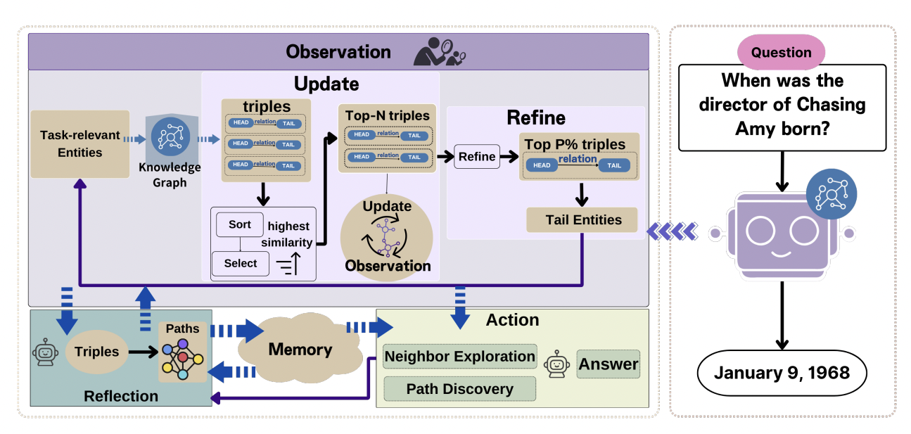
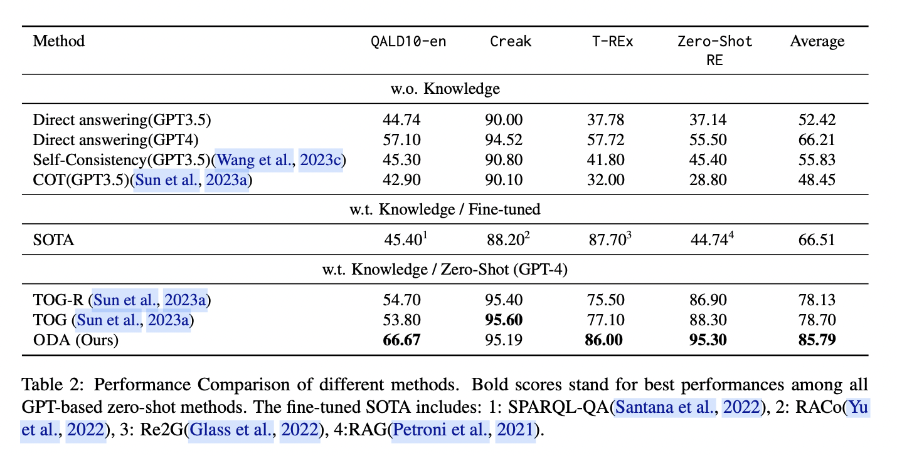

# ODA: Observation-Driven Agent for integrating LLMs and Knowledge Graphs

## Overview

This repository contains the code and dataset associated with the subgraphs used in the paper [ODA: Observation-Driven Agent for integrating LLMs and Knowledge Graphs](https://arxiv.org/abs/2404.07677)

## Abstract

The integration of Large Language Models (LLMs) and knowledge graphs (KGs) has achieved remarkable success in various natural language processing tasks. However, existing methodologies that integrate LLMs and KGs often navigate the task-solving process solely based on the LLM's analysis of the question, overlooking the rich cognitive potential inherent in the vast knowledge encapsulated in KGs. To address this, we introduce Observation-Driven Agent (ODA), a novel AI agent framework tailored for tasks involving KGs. ODA incorporates KG reasoning abilities via global observation that enhances reasoning capabilities through a cyclical paradigm of observation, action, and reflection. Confronting the exponential explosion of knowledge during observation, we innovatively design a recursive observation mechanism. Subsequently, we integrate the observed knowledge into the action and reflection modules. Through extensive experiments, ODA demonstrates state-of-the-art performance on several datasets, notably achieving accuracy improvements of 12.87% and 8.9%.


## The overall framework of ODA



## Main Result



## Description

1. **QAdata/**: Contains commonly used KBQA datasets from the state-of-the-art (SOTA).
- Overall Summary
  
- Wikidata-based datasets:
  - QALD10-en
  - T-REx
  - Zero-Shot RE
  - Creak

- Freebase-based datasets:
  - GrailQA
  - WebQSP
  - Simple Questions

- SOTA
  - [KAPING](https://arxiv.org/abs/2306.04136)
  - [ToG](https://arxiv.org/abs/2307.07697)
  - [RoG](https://arxiv.org/abs/2310.01061)
  - [StructGPT](https://arxiv.org/abs/2305.09645)

   
2. **generate_subgraph/**: Includes Wikidata environment settings and code for generating subgraphs.

   We deployed the Wikidata dump across five AWS EC2 instances, each consisting of a 768GB machine with 48 cores.
   **generate_subgraph/Wikidata/** contains the deployment and knowledge extraction codes.
   **generate_subgraph/subgraph_gen.py** is The specific code used for generating the subgraphs.


## Subgraph Datasets

The subgraphs based on Wikidata or Freebase can be found here [Subgraph datasets on huggingface](https://huggingface.co/datasets/CCaccept/Subgraph)

The dataset comprises four folders, each containing subgraphs related to different KBQA datasets based on Wikidata or Freebase:

- hop_2_FreeBase/: Contains 2-hop subgraphs based on Freebase.
- hop_3_FreeBase/: Contains 3-hop subgraphs based on Freebase.
- hop_2_Wikidata/: Contains 2-hop subgraphs based on Wikidata.
- hop_3rd_Wikidata/: Contains the third hop subgraphs based on Wikidata.

### The format of the subgraph files
1. FreeBase subgraph file
```
{
Topic Entity : [[EntityID,Relation,EntityID],....],
Topic Entity : [[EntityID,Relation,EntityID],....],
...
}
```
2. FreeBase label file
```
{
EntityID : Entity name
EntityID : Entity name
...
}
```

3. Wikidata subgraph file
```
{
Topic Entity : [[EntityID,RelationID,EntityID],....],
Topic Entity : [[EntityID,RelationID,EntityID],....],
...
}
```
2. Wikidata label file

```
{
EntityID : Entity name
RelationID : Relation name
EntityID : Entity name
...
}
```

## Citation

If you use the code or dataset provided in this repository, please consider citing the following paper:

```
@misc{sun2024oda,
      title={ODA: Observation-Driven Agent for integrating LLMs and Knowledge Graphs}, 
      author={Lei Sun and Zhengwei Tao and Youdi Li and Hiroshi Arakawa},
      year={2024},
      eprint={2404.07677},
      archivePrefix={arXiv},
      primaryClass={cs.CL}
}
```

